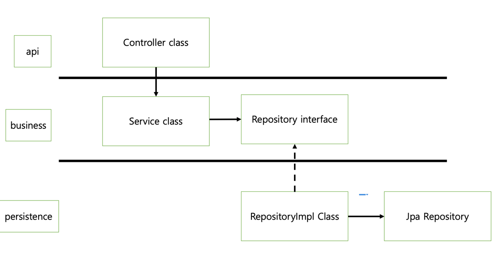
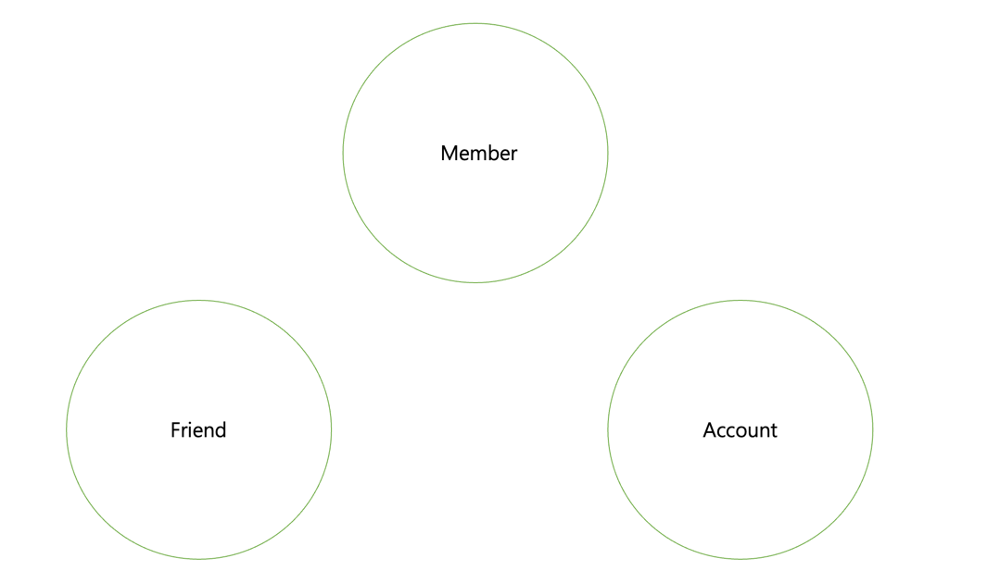

# 뱅킹 시스템

- 시간상 테스트 코드는 다 작성하지 않음
- 프로덕션 코드 위주로만 작성했습니다.

# 코드 아키텍처

- 
- controller Class는 Service class를 의존합니다.
- service는 따로 인터페이스로 추상화하지 않고 바로 class로 사용했습니다.
- service에는 핵심 비즈니스 로직이 담겨 있기에 비즈니스 로직이 바뀌면 class 자체를 바꾸면 된다고 생각했습니다.
- repository는 interface로 추상화를 시켰습니다.
- DB 접근 기술이 바뀌어도 호출하는 쪽에서는 알 수 없게 하기 위해서 추상화를 시켰습니다.

# 도메인

- member, friend, account 각각을 하나의 애그리거트로 생각했습니다.
- 라이프 사이클이 서로 연관이 되지 않는다고 생각을 했습니다.

# DB

- 한 명의 유저는 여러 명의 친구를 가질 수 있기에
- 멤버와 프렌트를 1대 다로 생각했습니다.
- 한 명의 유저는 여러 개의 계좌를 만들 수 있기에
- 멤버와 어카운트를 1대 다로 생각했습니다.
- 다만 실제 코드에서는 멤버가 생성이 될 때 friend와 account가 같이 만들어지는 것이 아니고
- friend 또는 account가 삭제될 때 member가 삭제 되는 것이 아니기에
- @ManyToOne와 같은 애노테이션을 사용하지 않고 id 값을 이용한 간접 참조 방식으로 구현했습니다.

# 동시성 문제
- redis의 lettuce를 이용해서 해결했습니다.
- synchornized 키워드는 한 개의 프로세스에서만 보장되기에 서버가 여러 대일 때의 동시성 문제가 발생합니다.
  - 이러한 이유로 synchronzied는 사용하지 않았습니다.
- DB Lock은 락을 작고 있는 트랜잭션 작업이 길어지면 커넥션 수가 모자라게 되는 문제가 발생할 수 있어서 이로 인해 서비스가 느려질 수 있기에
- 사용하지 않았습니다.
- redis를 사용하게 되면 위와 같은 문제를 겪지 않아도 되고 속도가 더 빠르기에 redis를 사용했습니다.

- 재시도가 필요 없다고 생각해서 Redisson대신 lettuce로 사용했습니다.
- lettuce 방식은 spin lock 방식을 이용해서 구현했습니다.
  - while 문을 통해서 lock을 획득할 때까지 요청을 보냅니다.
  - lock을 획득하면 메서드를 수행하고 획득하지 못하면 기다립니다.
  - 다만 sprin Lock 방식이기에 Redis에 부하를 줄 수 있어서 sleep도 같이 넣어줬습니다.

# 궁금한 점
- MemberService의 save method에서 memberFactory를 이용해서 member를 만들어주고 있는데
- member를 만들어주는 책임을 factory로 옮긴 것인데 괜찮을 방법일까요?
- Member와 Friend는 member가 생성이 될 때 Friend가 생성이 되는 것이 아니고 friend가 생성이 될 때 Member가
  - 생성이 되는 것이 아니여서 서로 다른 라이프 사이클을 가진다고 생각했습니다.
  - 그래서 패키지 자체도 서로 분리를 해서 만들었습니다.
  - 서로 분리를 하는 게 맞을까요??
  - 다만 여기서 의문점이 Member가 삭제되면 Friend table에 있는 값도 다 삭제가 되어야 하는데 이럴 경우 분리를 하는 게 맞는건지 궁금합니다.
- Alarm 서비스는 외부 기술이라고 생각해서 infra 패키지를 따로 만들어서 여기에 만들었습니다.
  - infra로 뺴는 게 맞을까요?
- 현재는 프로젝트가 그렇게 크지 않아서 따로 domain 패키지를 만들지 않고 infra 패키지에 있는 entity만을 이용했습니다.
  - 프로젝트가 더 커진다면 domain 패키지(db 기술에 의존적이지 않는)를 따로 만들어야 할까요?
# 피드백 받고 싶은 부분
- 변수명 및 메서드 명이 적절한가.
  - Dto -> dto로 변환할 때 toRequestDto와 같이 이름을 지었는데 괜찮은 이름인가.
